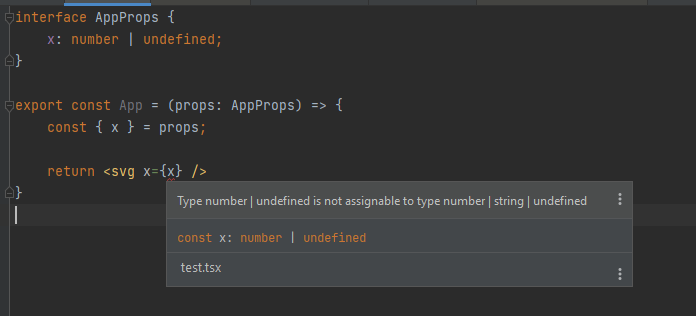

# About

This project reproduced weird behavior of Typescript Server for projects which uses WSL and Yarn PnP.

## The Problem
1. Open `.yarnrc.yml` and uncomment line `nodeLinker: pnp`
2. Run `yarn install` in terminal
3. Open `test.tsx` file. You should see the error about `x` property of `svg` is invalid
   1. If error does not occur try to open settings and click `save` or try to change anything in file `index.tsx` - some time later the problem will occur.
You will see the next error:

Then:
1. Open `.yarnrc.yml` and comment line `nodeLinker: pnp` and uncomment line `nodeLinker: node-modules`
2. Run `yarn install` in terminal

You should see that error disappeared.

## My environment 

### IDEA
WebStorm 2021.3 EAP
Build #WS-213.5744.37, built on November 12, 2021
WebStorm EAP User
Expiration date: December 12, 2021
Runtime version: 11.0.13+7-b1751.19 amd64
VM: OpenJDK 64-Bit Server VM by JetBrains s.r.o.
Windows 11 10.0
GC: G1 Young Generation, G1 Old Generation
Memory: 2048M
Cores: 16
Non-Bundled Plugins:
com.intellij.lang.jsgraphql (3.0.0)

### OS and WSL
Windows 11 x64 with the latest updates on 17 November 2021;
WSL 2 with the latest updates and next environment:
* Ubuntu 20.04
* Node.js 14.17.1

### 
